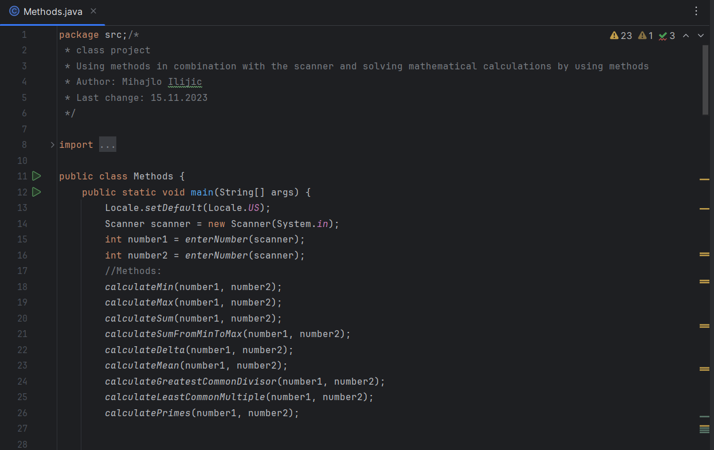

# Methods.java
## Explanation
Reading two numbers from the user and proceduring arithmetic operations by using methods and giving an output over the console.

## Features
- A method with return value which allows the user to insert integer numbers.
- two integer variables number1 and number2 in the main method initialized by the read number from the user
- void methods which have the feature of calculating arithmetic operations by using the two numbers **int number1** and **int number2**:

--using:
```java
private static void calculateMin(int number1, int number2)
```
which calculates and displays the maximum of the two numbers
--using:
```java
private static void calculateMax(int number1, int number2)
```
which calculates and displays the minimum of the two numbers
--using:
```java
private static void calculateSum(int number1, int number2)
```
which calculates and displays the sum of number1 and number2 of the two numbers
--using:
```java
private static void calculateSumFromMinToMax(int number1, int number2)
```
which calculates and displays the sum of all integer numbers between minimum and maximum including minimum and maximum.
--using:
```java
    private static void calculateDelta(int number1, int number2) 
```
which calculates and displays the difference of minimum and maximum.
--using:
```java
    private static void calculateMean(int number1, int number2) 
```
which calculates and displays the mean value of all integer numbers between minimum and maximum including minimum and maximum.
--using:
```java
    private static void calculateGreatestCommonDivisor(int number1, int number2) 
```
in order to calculate and display the greatest common divisor of the two input numbers. For the understanding of the for loop which was used for this calculation, there is a detailed instruction in the code comment above the method.
--using:
```java 
    private static void calculateLeastCommonMultiple(int number1, int number2) 
```
which calculates and displays the least common multiple of number1 and number2. The formula which was used to calculate the least common multiple in this method was: **multiplying number1 and number2, then dividing the product by the greatest common divisor.**
--using:
```java
    private static void calculatePrimes(int number1, int number2) 
```
which arithmetically finds and displays all prime numbers between number1 and number2 including the two values.
## Tech
- In order to write this Java code and terminate it, you need to install a Java Development Kit (JDK) and an Integrated Development Environment (IDE) like IntelliJ IDEA, Eclipse or NetBeans. 
- You need to make sure that your computer specifications support the tools which have to be installed.
## Picture

## Author
Author: Mihajlo Ilijic 
Date of the last update: 05.03.2024
Contact: mihajlo.ilijic@edu.fh-joanneum.at
+43 (0)660 857 0913

        
