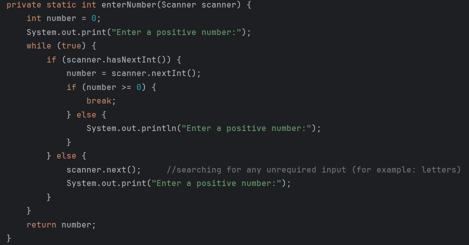
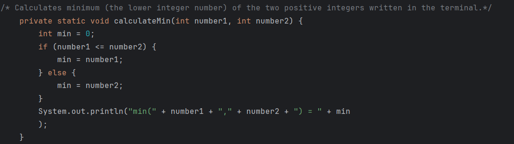

# exercise1
## Method example in java

Methods which have the functionality of reading int numbers or String are 
often implemented in a code.
## Methods in general
Methods are used in progarmming with the idea of using a function multiple times in the code. By using methods instead of repeating the same code several times, the code gets a more compact form and is easier to understand.
## More about methods
Despite the methods which return values like it is the case in the previous
shown ReadNumber method, method can also just display results:

### Author
Author: Mihajlo Ilijic
Contact: mihajlo.ilijic@edu.fh-joanneum.at
+43 (0)660 857 0913
Date of the last update: 04.04.2024