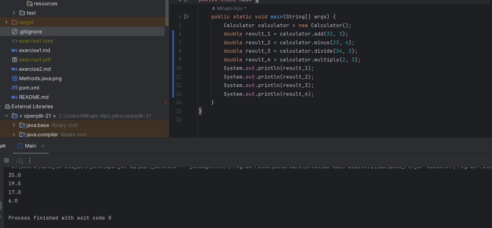

# Exercise3

## Beschreibung
Es wurden 4 Methoden für die 4 Haupt-Operationen erstellt mit 
je zwei Übergabeparametern. Die Zahlen die für die Berechnungen 
verwendet werden , werden manuell eingegeben. Die Ergebnisse 
werden als double-Werte über System.out.print auf der Konsole 
ausgegeben. Man kann noch eventuell mögliche Ergebnisse im Kopf 
ausrechnen und dann mit der Ausgabe auf der Konsole vergleichen.
