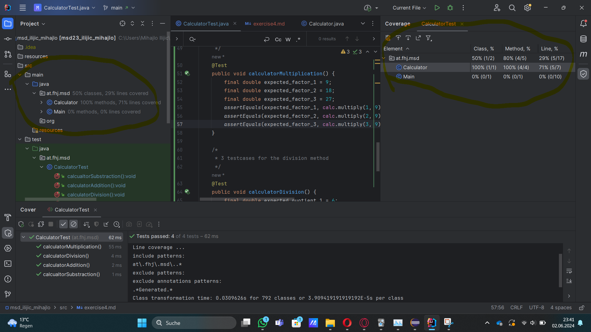
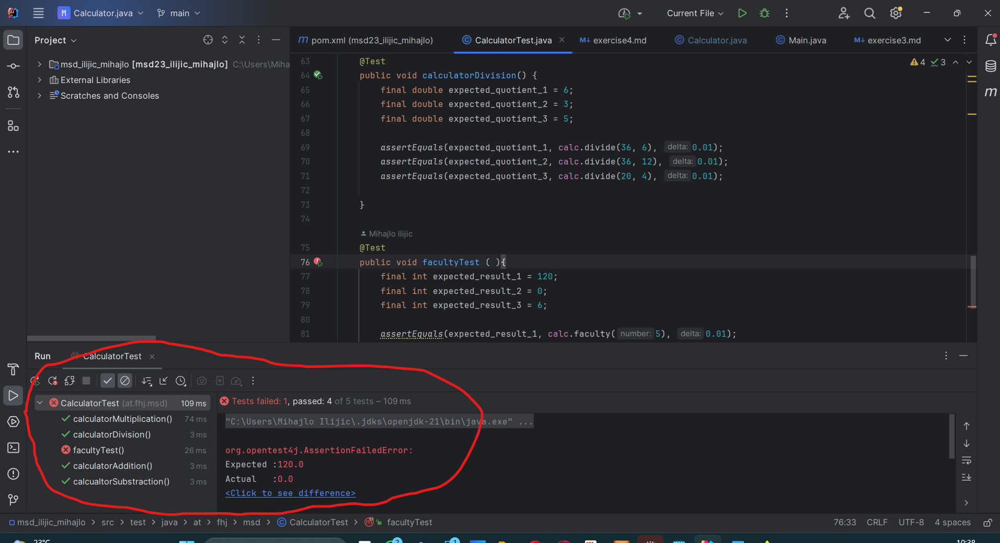
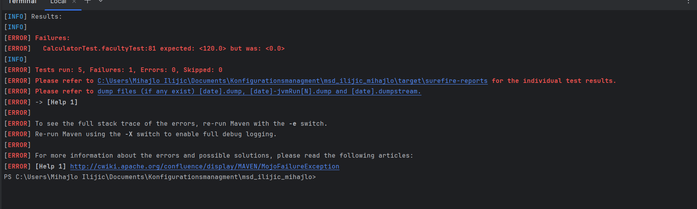

# Testcases

In diesem Fall funktionieren alle Testcases einwandfrei. Das kann der Implementierende
in diesem Fall durch grundlegende Kopfrechnung bestätigen. Daher kann man fesstellen das die Methoden
korrekt implementiert wurden.

## Fehlermeldung

In diesem Fall wurde meinerseits eine faculty Methode implementiert, die den Wert 0 zurückgibt und sonst
nichts. Dementsprechend ist auch eine Fehlermeldung bei der Kompilierung der Testcases ersichtlich.

## Fehlererkennung

Wenn man in der cmd Line mvn test eingibt, so erhält man genaue Hinweise, wo es zu einem Fehler gekommen ist.