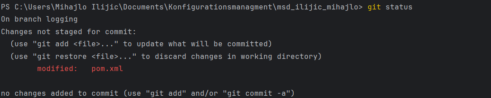
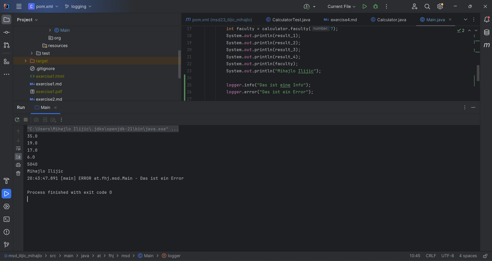

# Exercise 5

### Aufgabe 1

- Auf der ersten Bildchirmaufnahme ist es ersichtlich, dass ich mich im
Branch 'logging' befinde und dass Änderungen in der pom.xml durchgeführt wurden.

### Aufgabe 2

### Aufgabe 4

